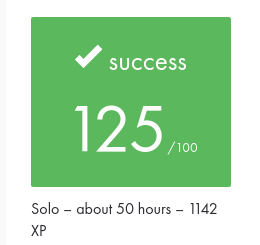

# Academic Record

This page records the academic provenance of the original **minitalk** project
and distinguishes it from the later maintained portfolio version.

## Project record

| Field | Record |
| --- | --- |
| Project | minitalk |
| Curriculum | 42 Common Core |
| Development mode | Solo |
| Final evaluation | 125/100 |
| Workload shown by the supplied 42 Intra record | Approximately 50 hours |
| XP shown by the supplied 42 Intra record | 1142 XP |
| Supplied subject reference | Version 5.0 |

The workload and XP values above reproduce the information visible in the
supplied 42 Intra record. They are not independently measured development
metrics.

## Evaluation evidence

The image above is a privacy-conscious crop of the original evaluation record.
It retains the project result and relevant academic summary while excluding
unnecessary evaluator identities, comments, private URLs, and surrounding
platform navigation.

The supplied record shows a final evaluation of **125/100** for the solo
project.

## Subject provenance

The supplied documentary reference identifies the project as **Minitalk,
Version 5.0**.

The subject itself is not redistributed in this portfolio repository. Its
version is recorded here so that the maintained implementation and
documentation can be compared against the supplied project specification
without publishing the original PDF.

The supplied subject version is treated as a documentary reference. This
repository does not claim that the reference independently proves the exact
subject revision used on the original evaluation date.

## Bonus scope and maintained validation

The supplied Version 5.0 subject describes bonus behaviour including:

- acknowledgement from the server after a complete message is received; and
- support for Unicode characters.

The maintained portfolio implementation was revalidated after modernization.

The validation confirmed:

- per-bit synchronization between client and server;
- final complete-message acknowledgement;
- exact ASCII message reconstruction; and
- successful end-to-end transmission of a representative UTF-8 message.

The representative UTF-8 validation demonstrates byte-preserving transport for
the tested message. It is not presented as exhaustive proof for every possible
Unicode input or encoding edge case.

## Historical provenance

The tag:

`portfolio-baseline-2026-09`

preserves the repository state immediately before the professional portfolio
modernization work.

The baseline is intentionally preserved as immutable historical provenance. It
is not presented as a guarantee that its commit is the exact commit evaluated
by 42, because repository maintenance may have occurred before the portfolio
modernization baseline was created.

The existing:

`v1.0.0`

tag also remains unchanged.

Later portfolio work is recorded through normal Git history rather than by
rewriting these historical references.

## Academic and maintained states

The repository therefore distinguishes between two related states:

**Academic project**

- developed as a solo 42 Common Core project;
- evaluated at 125/100;
- developed under the academic project constraints;
- historically preserved through the repository's existing Git history and
  pre-modernization baseline.

**Maintained portfolio version**

- retains the original project behaviour;
- uses the canonical external Libft dependency;
- includes automated regression testing and CI;
- includes maintained Doxygen interface documentation;
- uses a professional root-level repository structure; and
- documents later maintenance and AI-assisted engineering work transparently.

This separation preserves the project's academic provenance while allowing the
repository to evolve as maintained engineering work.
